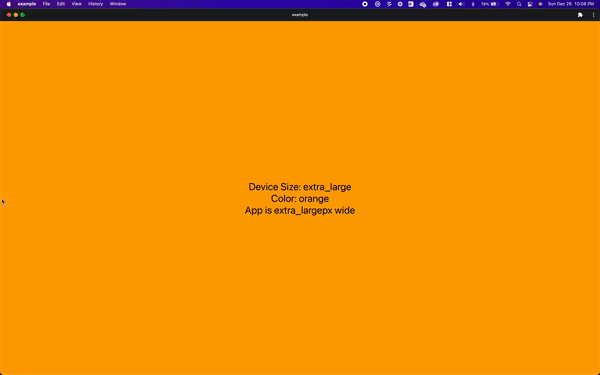

<h1 style='text-align: center'>
    React Native Responsive Styles
</h1>

<p style='text-align: center'>
  <strong>rn-responsive-styles</strong><br>
  Create responsive styles for react-native and react-native-web with minimal re-renders
</p>

<p style='text-align: center'>
    <a href="https://www.npmjs.org/package/rn-responsive-styles">
        
    </a>
    <a href="https://codecov.io/gh/khevamann/rn-responsive-styles">
       
    </a>
</p>

This library adds support for dynamic styling based on device size, it was built to replace inline dynamic styles for
individual components.

This library builds a single stylesheet from the provided styles and conditionally returns them based on device size. It
uses a custom version of React Native's `useWindowDimensions` so that it only re-renders when the device size passes
over one of the breakpoints, instead of re-rendering on every pixel change.

# Installation

`yarn add rn-responsive-styles`
or
`npm install rn-responsive-styles --save`

# Demo



# Usage

```typescript jsx
import { Text, View } from 'react-native'
import { CreateResponsiveStyle, DEVICE_SIZES, useDeviceSize } from 'rn-responsive-styles'

export default function App() {
  const styles = useStyles()
  const deviceSize = useDeviceSize()

  return (
    <View style={styles.container}>
      <Text style={styles.text}>Device Size: {deviceSize}</Text>
    </View>
  )
}

const useStyles = CreateResponsiveStyle(
  {
    container: {
      flex: 1,
      backgroundColor: '#fff',
      alignItems: 'center',
      justifyContent: 'center',
    },
    text: {
      fontSize: 30,
      color: 'white',
    },
  },
  {
    [DEVICE_SIZES.XL]: {
      container: {
        backgroundColor: 'blue',
      },
    },
    [DEVICE_SIZES.SM]: {
      container: {
        backgroundColor: 'red',
      },
      text: {
        fontSize: 20,
      },
    },
  }
)
```

### Simple Media Queries

To specify styles that apply to multiple device sizes you can use the built in `minSize()` and `maxSize()` functions.
These allow you to specify styles similar to CSS media queries `min-width` and `max-width`.

```typescript jsx
import { CreateResponsiveStyle, DEVICE_SIZES, minSize, maxSize } from 'rn-responsive-styles'

const useStyles = CreateResponsiveStyle(
  { ... },
  {
    // Will apply the size 30 font to large and extra large devices
    [minSize(DEVICE_SIZES.LG)]: {
      text: {
        fontSize: 30,
      },
    },
    // Will apply the size 20 to medium, small and extra-small devices
    [maxSize(DEVICE_SIZES.MD)]: {
      text: {
        fontSize: 20,
      },
    },
  },
)
```

## Breakpoints

The currently configured breakpoints are:

|    Size     |               Value               |     Shorthand     |      Breakpoints      |
|:-----------:|:---------------------------------:|:-----------------:|:---------------------:|
| extra small | `DEVICE_SIZES.EXTRA_SMALL_DEVICE` | `DEVICE_SIZES.XS` |    `width <= 540`     |
|    small    |    `DEVICE_SIZES.SMALL_DEVICE`    | `DEVICE_SIZES.SM` | `540 < width <= 768`  |
|   medium    |   `DEVICE_SIZES.MEDIUM_DEVICE`    | `DEVICE_SIZES.MD` | `768 < width <= 992`  |
|    large    |    `DEVICE_SIZES.LARGE_DEVICE`    | `DEVICE_SIZES.LG` | `992 < width <= 1200` |
| extra large | `DEVICE_SIZES.EXTRA_LARGE_DEVICE` | `DEVICE_SIZES.XL` |    `1200 < width`     |

### Customizing Breakpoints

If you would like to change the breakpoints you can wrap your entire app in the `BreakpointsProvider` this will allow
you to specify exactly when styles will come into effect. This is optional and only required for finer control over
styling different device sizes.

```tsx
import { BreakpointsProvider } from 'rn-responsive-styles'

export default function App() {
  return (
    <BreakpointsProvider breakpoints={[1200, 992, 768, 540]}>
      <Component />
    </BreakpointsProvider>
  )
}
```

## Support for Next.js

:sparkles:Available in 2.1.0:sparkles:

NextJS provides server-side-rendering (SSR) for react-native-web projects. This library supports that by delaying
rendering until it has reached the client, this is a similar approach used by many other packages, as there is no way to
know the device size in the server, so responsive styles are meaningless. In order to support SSR you must add this
provider to your component that imports any component relying on `rn-responsive-styles`. The best way to do this is in
your App.tsx or index.tsx file add the `SSRProvider`

```tsx
import { ActivityIndicator } from 'react-native'
import { SSRProvider } from 'rn-responsive-styles'

export default function App() {
  return (
    <SSRProvider placeholder={<ActivityIndicator />}>
      <Component />
    </SSRProvider>
  )
}
```

* You can see the full example in the nexpo-example directory


# Upgrading to V2 (from V1)

V2 provides some very useful features like advanced typechecking as well as a more familiar syntax. Instead of using
functions to call styles, you can simply call them the same way you would normally. This means to gradually adopt this
library it is as simple as replacing `const styles = Stylesheet.create` with `const useStyles = CreateResponsiveStyles`
and adding `const styles = useStyles()` inside your component. With this update typechecking will now verify that styles
are used for appropriate components and that no css only styles are used. In addition, there is support for custom
breakpoints.

**To upgrade:**

1. Replace `const { styles } = useStyles()` with `const styles = useStyles()`
2. Replace all styling calls from `styles('container)` to `styles.container`
3. If you have been using `deviceSize` it is now a standalone hook `const deviceSize = useDeviceSize()`

